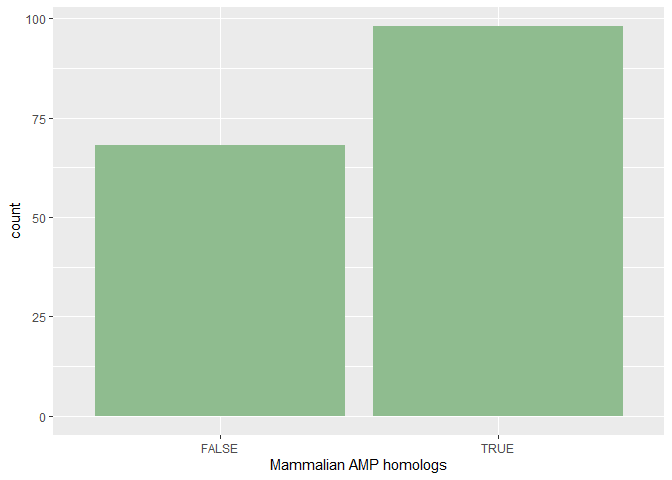
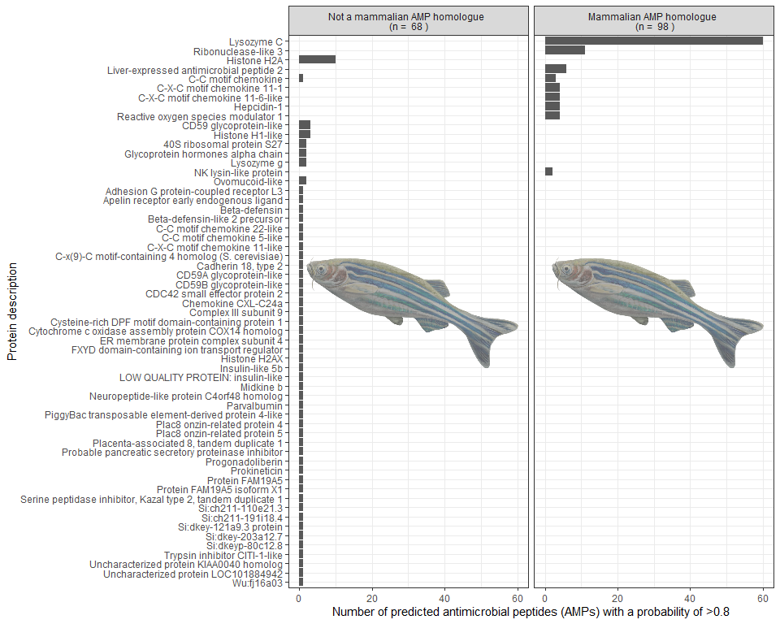

# Examining predicted AMPs in the zebrafish proteome :fish: compared to known mammalian AMPs

``` r
library(ampir)
library(tidyverse)
library(png)
```

## Get data

1)  Get the Zebrafish proteome from UniProt

``` bash
wget https://ftp.uniprot.org/pub/databases/uniprot/current_release/knowledgebase/reference_proteomes/Eukaryota/UP000000437/UP000000437_7955.fasta.gz -P data/
```

Read in the proteome

``` r
zebrafish_proteome <- read_faa("data/UP000000437_7955.fasta.gz")
```

2)  Download all reviewed antimicrobial peptides (AMPs) from mammals
    from UniProt using the Keyword \[KW\] KW-0929 AND Taxonomy \[OC\]
    AND reviewed :arrow_right:
    [here](https://www.uniprot.org/uniprotkb?query=%28taxonomy_id%3A40674%29+AND+%28keyword%3AKW-0929%29&facets=reviewed%3Atrue)

Read in mammalian AMPs and select the sequence names and sequences and
export as FASTA file

``` r
mammalian_amps <- readxl::read_excel("data/uniprotkb_taxonomy_id_40674_AND_keyword_2023_10_30.xlsx")

mammalian_amps %>% 
  select(Entry, Sequence) %>% 
  as.data.frame() %>% 
  df_to_faa("data/mammalian_amps.fasta")
```

## Predict AMPs

Predict AMPs (if needed, otherwise read in the previously predicted
AMPs)

``` r
if ( file.exists("data/zebrafish_prediction.rds")){
  zebrafish_prediction <- readRDS("data/zebrafish_prediction.rds")
} else {
  zebrafish_prediction <- predict_amps(zebrafish_proteome)
  saveRDS(zebrafish_prediction, "data/zebrafish_prediction.rds")
}
```

Extract predicted AMPs with high probability and save as FASTA

``` r
zebrafish_prediction_high_prob <- zebrafish_prediction %>%
  filter(prob_AMP > 0.8)

df_to_faa(zebrafish_prediction_high_prob, "data/zebrafish_pamps_high_prob.fasta")
```

## Homology

BLAST the predicted zebrafish AMPs against the mammalian AMPs (using
blast 2.12.0+)

``` bash
makeblastdb -in data/mammalian_amps.fasta -out data/blast_db/mammalian_amps.fasta -dbtype prot -max_file_sz '3GB'

blastp -query data/zebrafish_pamps_high_prob.fasta -db data/blast_db/mammalian_amps.fasta -outfmt '6 qaccver saccver pident length evalue bitscore mismatch gapopen qstart qend sstart send sstrand sframe stitle' -evalue 1e-5 -num_threads 8 -out data/blastp_fish_pamps_mammalian_amps.txt
```

Read in BLAST results

``` r
blastp_pamps_results <- read_tsv("data/blastp_fish_pamps_mammalian_amps.txt", col_names = c("qaccver", "saccver", "pident", "length", "evalue", "bitscore", "mismatch", "gapopen", "qstart", "qend", "sstart", "send", "sstrand", "sframe", "stitle"))
```

## Combine results

First add column with shortened names to match BLAST results

``` r
zebrafish_prediction_high_prob <- zebrafish_prediction_high_prob %>% 
  mutate(seq_name_short = str_extract(seq_name, "^(.*?)\\s")) %>% 
  mutate(seq_name_short = str_squish(seq_name_short))
```

One way to extract relevant information is to combine predicted
zebrafish AMPs with the BLAST results and the mammalian AMPs dataset
from UniProt (to get the UniProt annotations) which will result in a
really big table.

``` r
zebrafish_pamps_and_blastp_and_uniprot <- zebrafish_prediction_high_prob %>% 
  left_join(blastp_pamps_results, by = join_by(seq_name_short == qaccver)) %>% 
  left_join(mammalian_amps, by = join_by(stitle == Entry))
```

Make the table a bit more succint by selecting relevant columns and add
a column to say if the predicted AMP has homology to a known mammalian
AMP.

*Note I added the Protein families column which is a column you can
choose to add in [UniProt](https://www.uniprot.org/), I was looking at
the descriptions in here before deciding to extract the descriptions
from the Zebrafish proteome instead as many predicted fish AMPs did not
have homologs to the mammalian AMPs (and therefore were missing
annotations in the Protein families).*

``` r
zebrafish_annotated_table <- zebrafish_pamps_and_blastp_and_uniprot %>% 
  select(seq_name, seq_name_short, prob_AMP, stitle, `Entry Name`, `Protein families`) %>% 
  mutate(mammalian_amp_homolog = !is.na(stitle))
```

Finally you can use this table to make a figure showing how many of the
predicted AMPs are homologous to characterised mammalian AMP families.

``` r
zebrafish_annotated_table_count <- zebrafish_annotated_table %>% count(mammalian_amp_homolog, name = "count")

zebrafish_annotated_table_count
```

    ##   mammalian_amp_homolog count
    ## 1                 FALSE    68
    ## 2                  TRUE    98

## Plots

You can also show this count as a plot but it is not very interesting.
You can additionally filter the data for this plot to only show the most
well known mammalian AMP families (e.g., cathelicidins and defensins),
depending on what your focus is.

``` r
ggplot(zebrafish_annotated_table, aes(x = mammalian_amp_homolog)) +
  geom_bar(fill = "darkseagreen") +
  labs(x = "Mammalian AMP homologs")
```

<!-- -->

Depending on what you want to focus on (either the predicted AMPs that
are homologous to mammalian AMPs or not), you can also extract the
descriptions for the predicted AMPs in the zebrafish and plot one or the
other (e.g. by filtering out the ones that are not homologous to
mammalian AMPs), or both, as I have done in the below example. You can
improve this plot by improving the descriptions by e.g. grouping the
similar predicted AMPs for which there are multiple hits. E.g.,
histones, chemokines, beta-defensins, insulin-like (You can do this with
the `tidyverse` functions `mutate` and `case_when`)

``` r
zebrafish_annotated_table <- zebrafish_annotated_table %>% 
  mutate(pamp_description = str_extract(seq_name, "(?<= ).*(?=\\sOS=)"))
```

``` r
# create custom labels for the facets
facet_labels <- as_labeller(c(
  `FALSE` = paste("Not a mammalian AMP homologue \n (n = ", filter(zebrafish_annotated_table, mammalian_amp_homolog == F) %>% nrow(), ")" ),
  `TRUE` = paste("Mammalian AMP homologue \n (n = ", filter(zebrafish_annotated_table, mammalian_amp_homolog == T) %>% nrow(), ")" )
))
   
# read in and process an image to use as background (not necessary)
image <- readPNG("202101_Zebrafish.png") 
image <- image * 0.6 # make the image a bit more transparent
image_grob <- grid::rasterGrob(image, x = unit(0.5, "npc"), y = unit(0.5, "npc"))


zebrafish_annotated_table %>% ggplot(aes(x = forcats::fct_rev(forcats::fct_infreq(pamp_description)))) +
  geom_bar() +
  coord_flip() +
  facet_wrap(~mammalian_amp_homolog, labeller = facet_labels) +
  labs(y = "Number of predicted antimicrobial peptides (AMPs) with a probability of >0.8", x = "Protein description") +
  theme_bw() +
  annotation_custom(image_grob, xmin = -Inf, xmax = Inf, ymin = -Inf, ymax = Inf) # add the image to the plot
```

<!-- -->

Zebrafish png obtained from
[Wikimedia](https://commons.wikimedia.org/wiki/File:202101_Zebrafish.png)
